# Graded Assignment on MERN application using Kubernetes

## Step 1: Set Up Google Cloud Shell Environment:
- Go to the GCP console: https://console.cloud.google.com

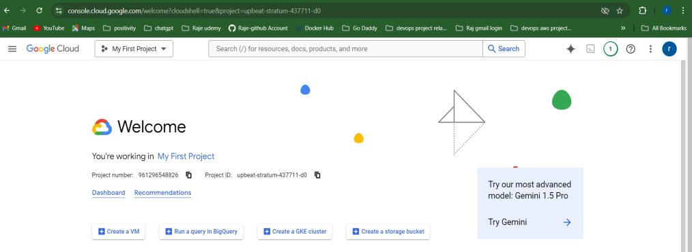

- Click on the terminal icon (Google Cloud Shell) at the top-right corner:

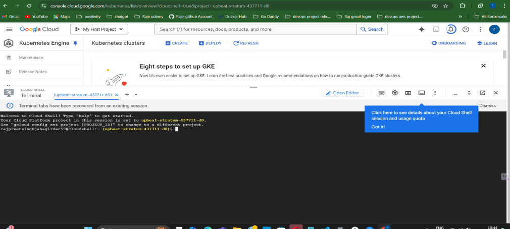

## 2. Set the GCP project:

- gcloud config set project [PROJECT_ID]

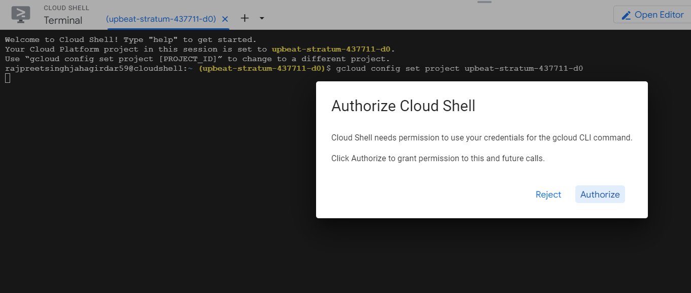

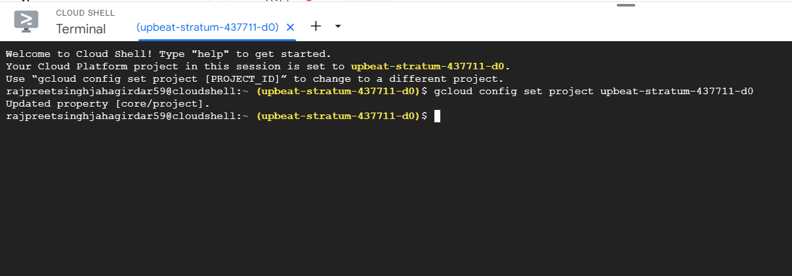

## 3. Enable required APIs: Enable the Google Kubernetes Engine (GKE) and Google 
- Container Registry (GCR) APIs: gcloud services enable container.googleapis.com
- gcloud services enable containerregistry.googleapis.com

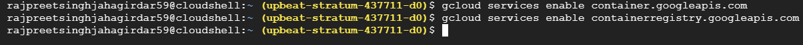

- Step 2: Create a GKE Cluster:
- Create the GKE cluster: Run the following command in Cloud Shell to create a 3-node GKE cluster in the specified zone: 

gcloud container clusters create mern-cluster --zone us-central1-a --num-nodes=3

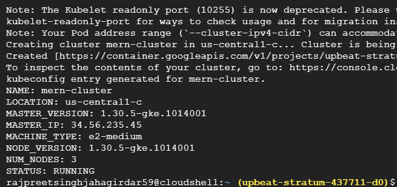

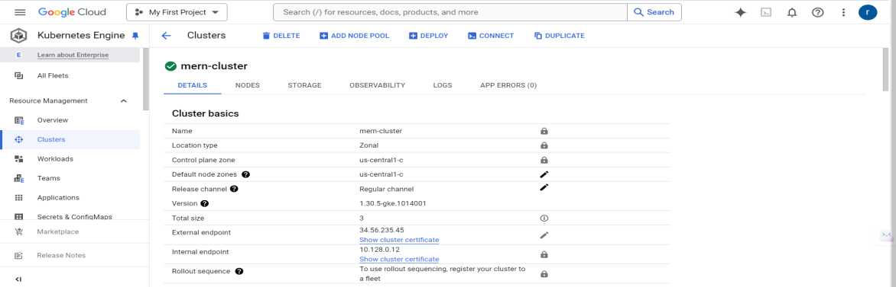

## 2. Get cluster credentials: Fetch the credentials for your newly created cluster:
gcloud container clusters get-credentials mern-cluster --zone us-central1-c

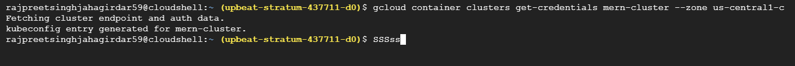

## Step 3: Clone the MERN Application Repository:
Clone the Sample MERN application: In Cloud Shell, clone the GitHub repository:

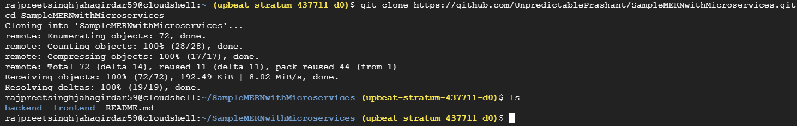

## Step 4: Build and Push Docker README_Images/images to Google Container Registry (GCR)

Authenticate with GCR:

gcloud auth configure-docker

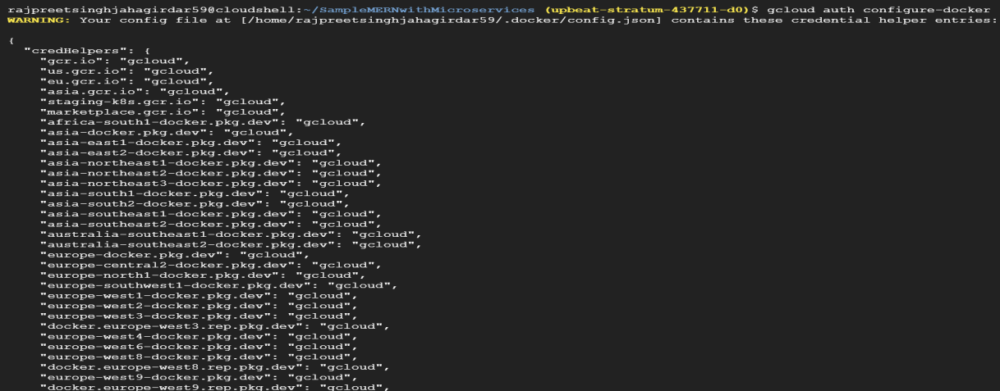

## Build and tag Docker README_Images/images: You need to build and tag Docker README_Images/images for the backend (helloService, profileService) and frontend.

## Backend (helloService):

cd backend/helloService
docker build -t gcr.io/[PROJECT_ID]/helloservice:v1 .

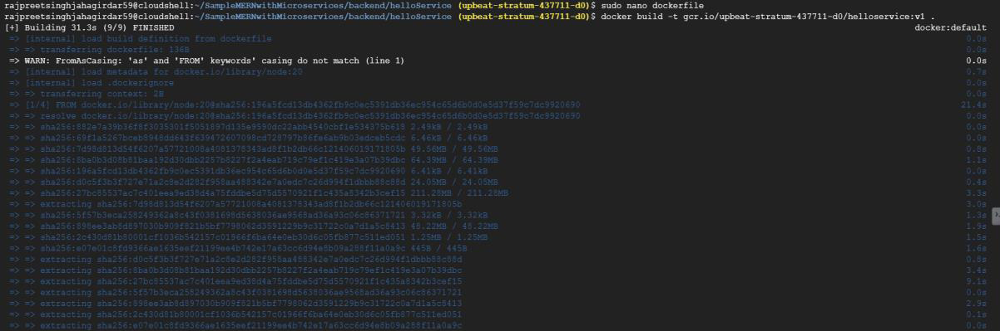

## Backend (profileService):

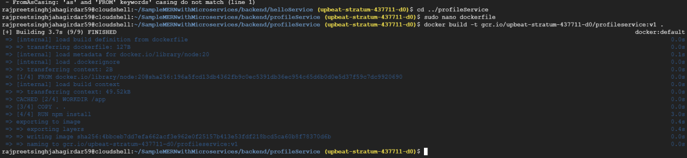

## Frontend:

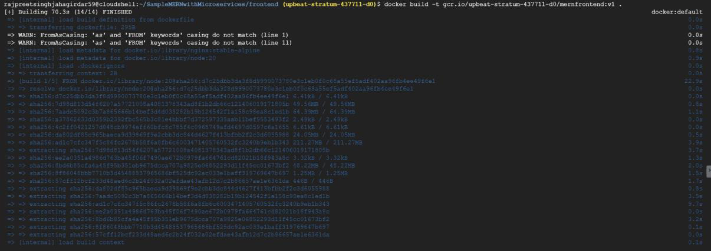

- 3. Push the Docker README_Images/images to GCR:
docker push gcr.io/[PROJECT_ID]/helloservice:v1

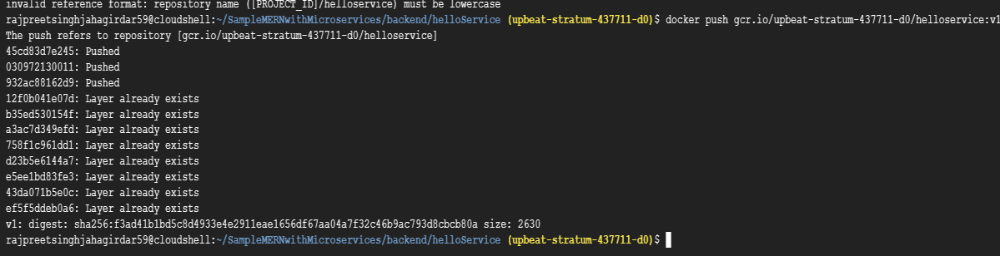

- For profileService:
docker push gcr.io/[PROJECT_ID]/profileservice:v1

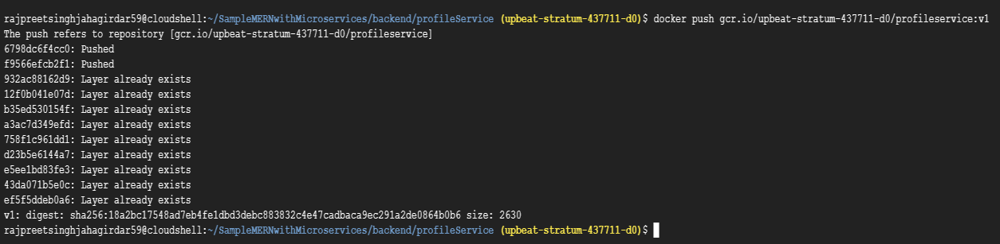

- For mernfrontend:

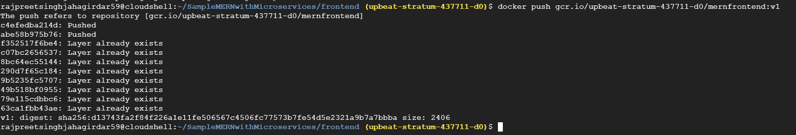

- Step 5: Create Kubernetes Deployment and Service Files:

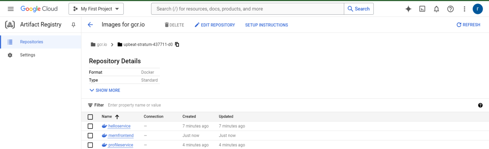

- In Cloud Shell, create Kubernetes YAML files for each microservice.

- 1. Create helloservice-deployment.yaml:

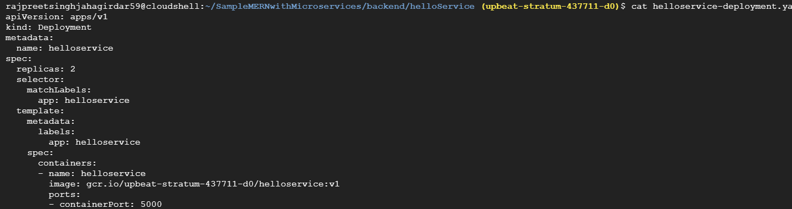

- 2. Create profileservice-deployment.yaml:

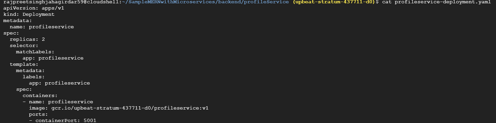

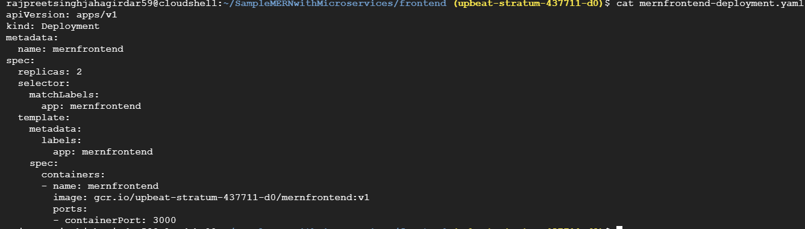

- 3. mernfrontend-service.yaml:

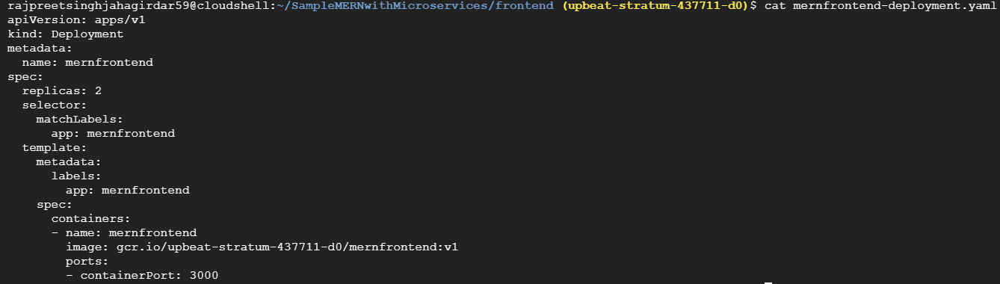

## 4. Create Service files for each microservice:

- helloservice-service.yaml:

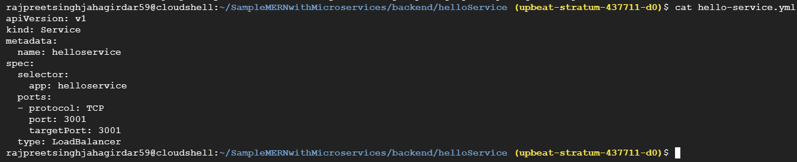

- profileservice-service.yaml:

- mernfrontend-service.yaml:

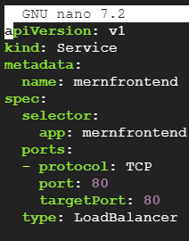

## Step 6: Deploy the Services to GKE:

- 1. Apply the deployments and services:
kubectl apply -f helloservice-deployment.yaml

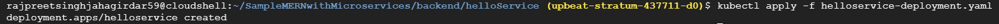

- kubectl apply -f profileservice-deployment.yaml

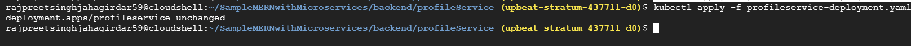

- kubectl apply -f mernfrontend-deployment.yaml

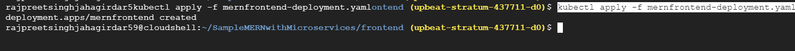

- kubectl apply -f helloservice-service.yaml

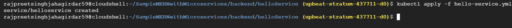

- kubectl apply -f profileservice-service.yaml

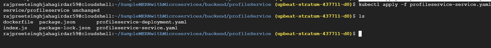

- kubectl apply -f mernfrontend-service.yaml

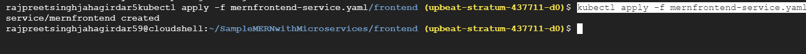

- 2.Verify that the services are running:
- kubectl get services

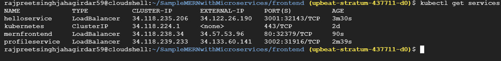

- Take note of the external IP addresses for each service. These IPs can be used to access the application in a browser. 
- Verify once if all the microservices pods are in running state:
- Kubectl get pods

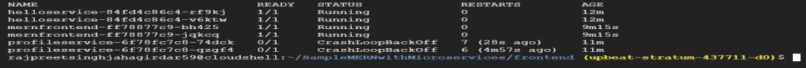

- Step 9: Push to GitHub

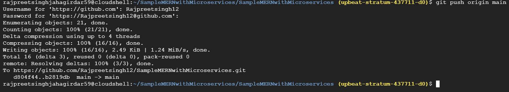

